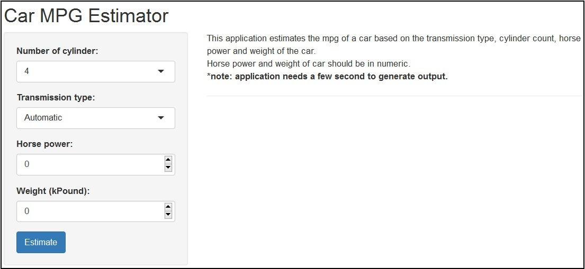
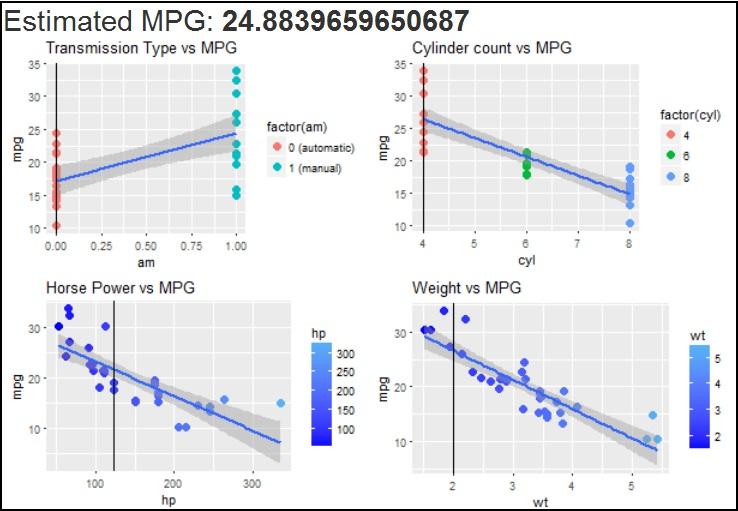

```{r setup, include=FALSE}
knitr::opts_chunk$set(echo = FALSE)
```

## Car

Car has been a daily necessity for many people.

- Transporting goods
- Traveling to work
- etc.

While it is convenient, but the fuel to power-up cars are expensive. This is one of the main concern when people buying a car. This application, MPG estimator will tells you roughly how fuel efficient is the car for a given set of property. 

## Car MPG Estimator

This application estimates the mpg of a car based on the input predictors value. The prediction is made by usingthe application will predict the mpg of your car using prediction model created based on mtcars dataset. prediction model created based on mtcars dataset.

There are 4 predictors used in this application for estimation such as

1. Transmission type
2. Cylinder count
3. Horse power
4. Weight

## Application At A Glance

Mpg estimator application is simple to use. Just key in the properties of your car and click the submit button.

```{r, out.width = "800px", fig.align="center"}

```
<center>Figure 1 : UI of MPG Estimator</center>

## Application At A Glance (Result)

Once predictors are set, the application will predict the mpg of your car and generates graphs to illustrate the relationship of predictors and mpg as well as your car's rank in general for each predictors. 

```{r, out.width = "800px", fig.align="center"}

```
<center>Figure 2 : Prediction Result of MPG Estimator</center>

## Thank You